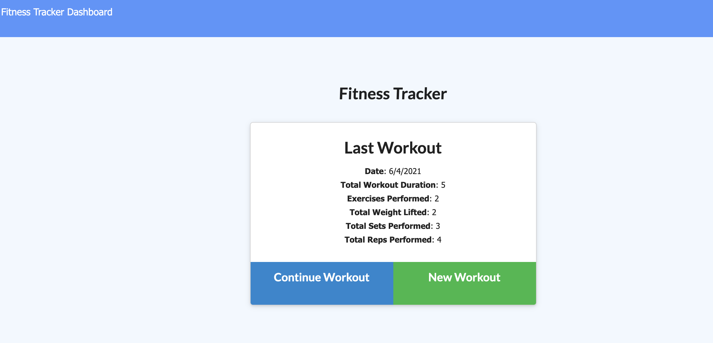

# Workout-Tracker

This is a workout tracker application that allows users to view create and track daily workouts. The user is able to log multiple exercises in a workout on a given day. The workouts are tracked by name, type, weight, sets, reps, and duration of the exercise. If the exercise is a cardio exercise, they are able to track the distance traveled.

# Technologies used

- Mongo Database
- Mongoose
- Express
- Node JS

# Deployed links:

https://afternoon-waters-53770.herokuapp.com/

https://github.com/rayaalsaedi/workout-tracker

# Preview of the app:

